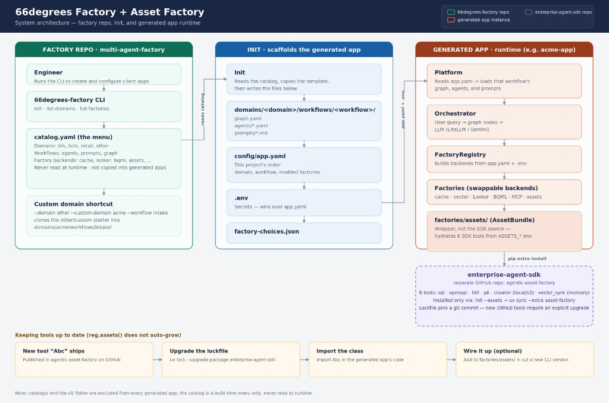

# Architecture

Factory repo (catalog + CLI) → `init` → generated app. The catalog is a build-time menu only. Asset Factory is a separate GitHub package (`uv sync --extra asset-factory`).

HTTP hits `app/main.py`. `Platform` (`app/platform.py`) connects `agents/` to `factories/`. Shared types and logging live in `shared/`.
